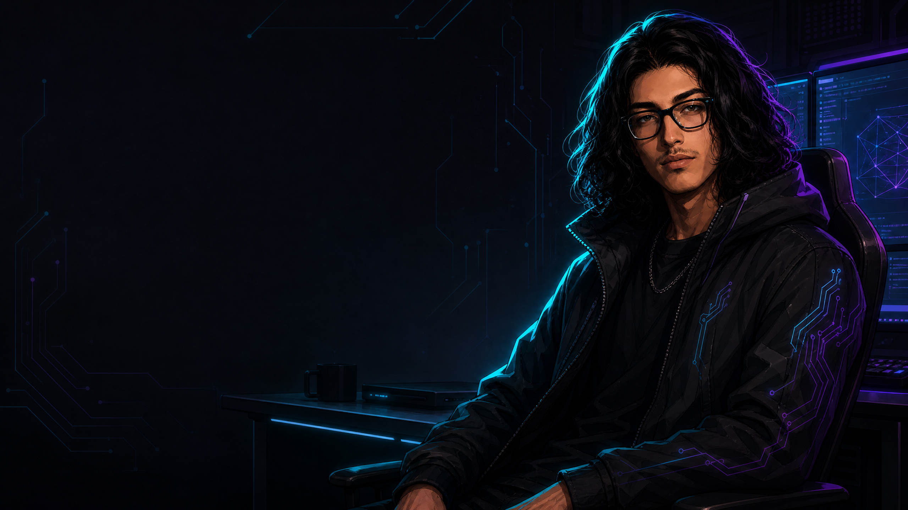
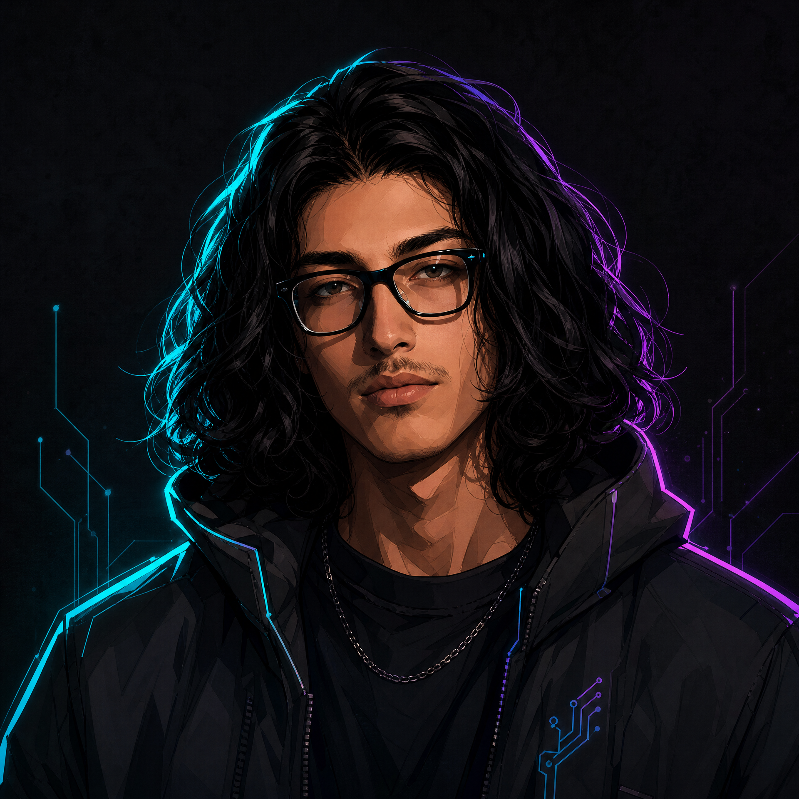

  

# Mustafa Güngör

### Computer Engineering Student · Edge AI · Computer Vision · ML & Systems

  
  

> **"I do not just train models. I connect perception, language and speech into systems that can be observed, tested and improved."**

<table>
<tr>
<td width="70%" valign="top">

## About me

I am an engineering-focused developer exploring **Edge AI, computer vision, and high-performance interactive systems**. I enjoy taking an idea beyond the notebook: wiring models into real inputs, defining stable interfaces, checking failure modes, and documenting what the evidence actually supports.

My working style is simple: **prototype quickly, measure honestly, and keep the rollback path**.

</td>
<td width="30%" valign="top" align="center">

<b>Mustafa Güngör</b> Research-minded Builder

</td>
</tr>
</table>

---

## 🚀 Featured Projects

### 🛡️ [Synapse Shield](https://github.com/0xStoic-bit/Synapse_Shield)
**Next-Gen Open-Source Behavioral Biometrics & Bot Mitigation Engine**

An ultra-low latency (`<0.5 ms`), privacy-first alternative to Cloudflare Turnstile that mitigates automated bots and scrapers using neuromuscular micro-tremors (**Jerk: $da/dt$**) and trajectory kinematics instead of intrusive CAPTCHAs.

| Layer | Focus |
| :--- | :--- |
| **Biomechanics** | 19D kinematic vectors (Velocity variance, Jerk spectrum, Straightness index) |
| **Ingress Engine** | Sub-millisecond decision engine with Poisson frequency anomaly detection |
| **Client Telemetry** | 50 Hz Vanilla JS SDK with zero-PII data collection (GDPR/KVKK compliant) |
| **Verification** | 6-vector Red Team adversarial simulation suite with 100% interception accuracy |

---

### 🤟 [NexusSign](https://github.com/0xStoic-bit/nexussign-stable-v1)
**Turkish Sign Language Edge AI Research Prototype**

An end-to-end Windows prototype combining camera-based landmark processing, static and dynamic sequence recognition, a Mini-SLM experiment, XTTS v2 speech synthesis, and a PySide6 command center.

| Layer | Focus |
| :--- | :--- |
| **Vision** | MediaPipe landmarks with static and dynamic recognition paths |
| **Inference** | Static 20-class and dynamic 7-class runtime contracts with CUDA & ONNX |
| **Language** | Standard Corpus-v2 Mini-SLM integration |
| **Speech** | XTTS v2 CUDA synthesis connected to the desktop UI |
| **Verification** | Shape guards, artifact checks, compile checks, and regression evidence |

> **Honest status:** Stable v1 verifies runtime integration and reproducibility. It does **not** claim reliable general-purpose Turkish Sign Language translation, gold-standard linguistic quality, or subject-independent recognition.

---

## 🛠️ Skills and Tools

  
  
  
  
  
  
  
  
  
  
  
  

<table>
<tr>
<td width="50%" valign="top">

### ⚙️ I build around
- Edge inference and runtime integration
- Computer vision and landmark features
- Behavioral biometrics and physical motion kinematics
- NLP and small language-model experiments
- Speech-enabled desktop interfaces

</td>
<td width="50%" valign="top">

### 🔍 I care about
- Reproducible experiments
- Explicit data and model contracts
- Defensive input validation & Zero-PII
- Runtime observability and low latency (<0.5ms)
- Backup-first changes & regression verification
- Evidence-based engineering claims

</td>
</tr>
</table>

---

## 🔬 Currently Exploring

**Multi-participant validation · Model generalization · Efficient edge deployment · Adversarial bot simulation · Responsible AI research**

The goal is not only to make a demo run. The goal is to understand where an intelligent system succeeds, where it fails, and how to improve it responsibly.

---

## 📊 GitHub Snapshot

  
  

---

## 🤝 Let’s Connect

I share project progress, experiments, and technical notes through GitHub and LinkedIn.

 

Open to Summer 2027 R&D, Computer Vision, Edge AI, and Embedded Software Internship Opportunities in Türkiye.

 

*Curiosity in the front. Evidence in the back.*

